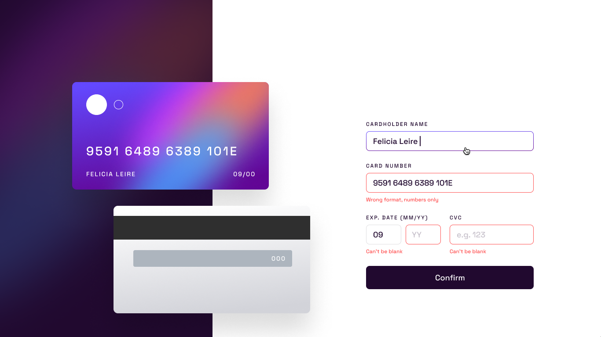
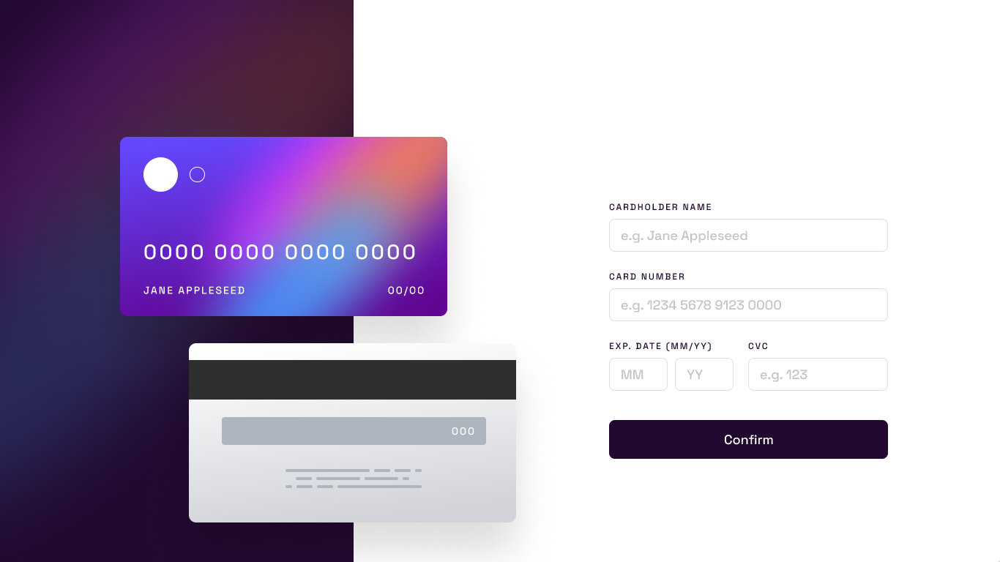
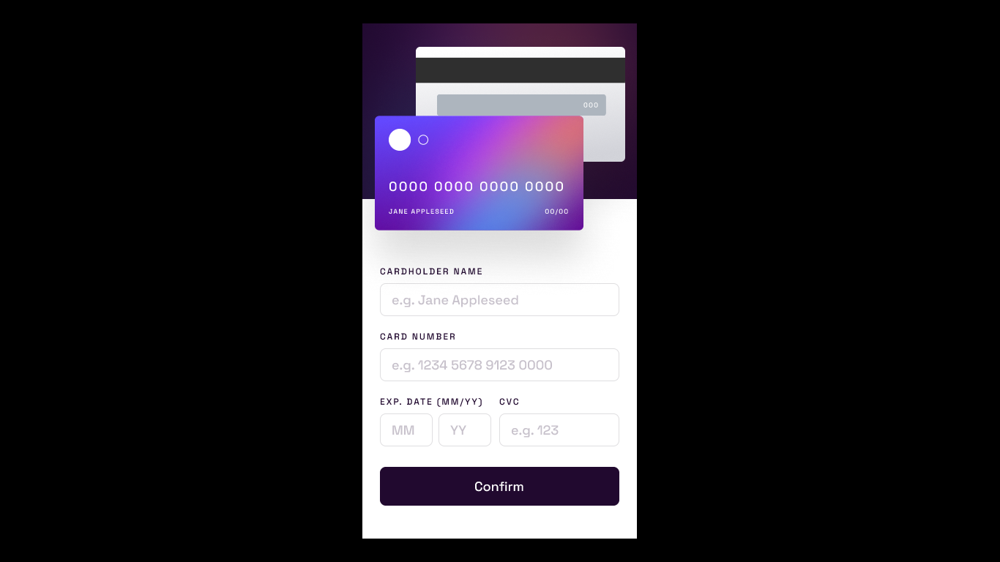
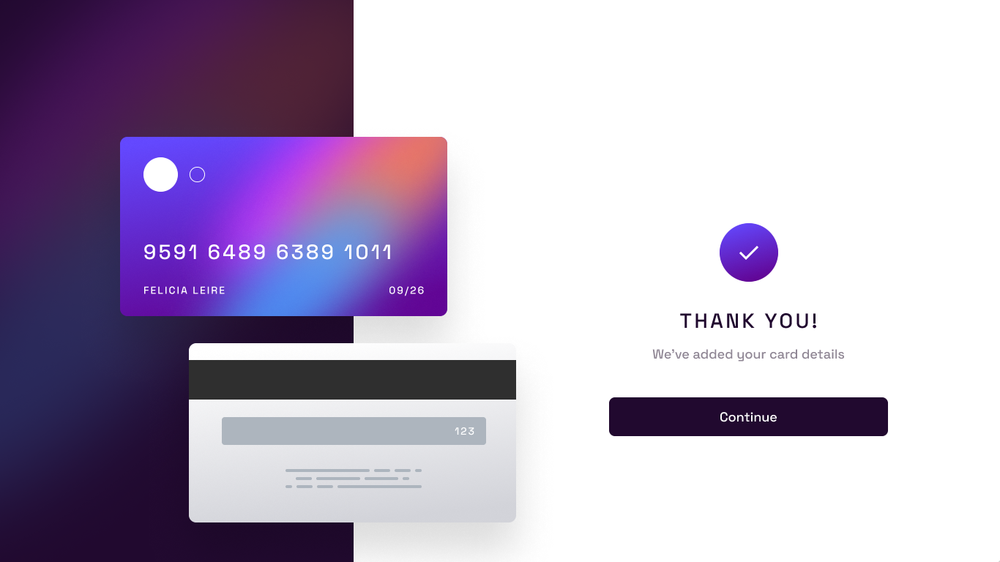
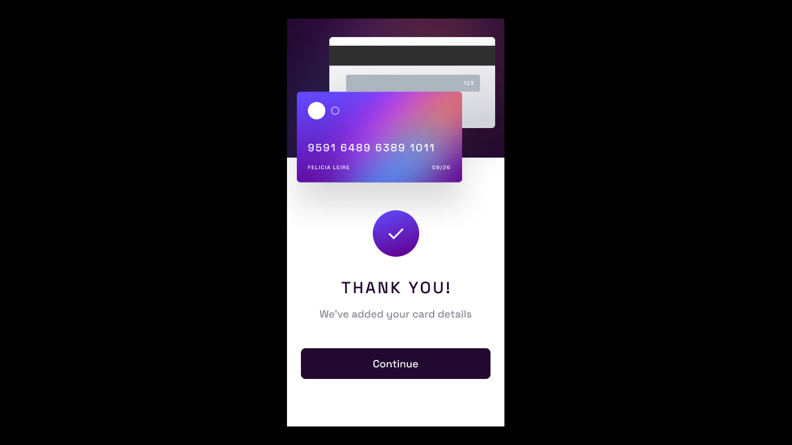

# Interactive card details form

## The challenge

The challenge is to build out this interactive card details form and get it looking as close as possible to [this design](https://www.figma.com/file/UeWhlG5b0lYZjVn3KzIve3/interactive-card-details-form?type=design&node-id=0%3A223&mode=design&t=SPVe0vMckAMbD722-1).

### Users should be able to:

* Fill in the form and see the card details update in real time

* Receive error messages when the form is submitted if:
  * Any input field is empty
  * The card number, expiry date, or CVC fields are in the wrong format

* See hover, active, and focus states for interactive elements on the page

* View the optimal layout depending on their device's screen size

* Make sure the numbers formats when typed into the input boxes

### Timeline

September 18th to September 22nd.
Deadline: September 22nd (Friday), 7pm.

### Built With:

* HTML
* CSS
* JavaScript

### Deployment